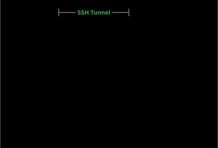

# AI Texture Generation Pipeline



GenAI uses a split architecture:
- **Client (local)**: the `generate_texture` function from `genai/client.py` sends the model, prompt and parameters to the server.
- **Server (remote)**: `genai/server.py` hosts the Flask API and runs generation via `genai/models.py` + `MV-Adapter`.

## Installation

### Credentials Setup (client & server)

1. Copy the appropriate ENV file
   ```bash
   # On the server
   cp .env.server.example .env

   # On the client
   cp .env.client.example .env
   ```

2. Fill in the appropriate variables
   |Variable|Description|Where|
   |:---|:---|:---|
   |MV_ADAPTER_PATH|Path to the directory where MV-Adapter is installed|Server|
   |SSH_HOST|Host address of the server|Client|
   |SSH_USER|SSH user on the server|Client|
   |SSH_KEY_PATH|Path to the SSH key to use|Client|
   |HF_TOKEN|Huggingface token|Client|

### Server setup (disco.hevs.ch)

1. Clone the main repository
   ```bash
   git clone git@github.com:Toys-R-Us-Rex/Duckify.git
   ```

2. Clone MV-Adapter
   ```bash
   git clone git@github.com:Toys-R-Us-Rex/MV-Adapter.git
   ```

3. Go in the GenAI directory
   ```bash
   cd Duckify/genai
   ```

4. Set up environment variables (see [Credentials Setup](#credentials-setup-client--server))

5. Don't forget to load the environnment file either in python code
   ```python
   load_dotenv("genai/.env")
   ```
   or loading directly into the terminal
   ```bash
   export $(cat .env | xargs)
   ``` 
   or while starting the server.py file
   ```bash
   uv run --env-file <path_to_.env> genai/server.py
   ``` 

6. Download all dependencies
   ```bash
   uv sync
   ```

### Client setup (local machine)

1. Clone the main repository
   ```bash
   git clone git@github.com:Toys-R-Us-Rex/Duckify.git
   ```

2. Go in the GenAI directory
   ```bash
   cd Duckify/genai
   ```

3. Set up environment variables (see [Credentials Setup](#credentials-setup-client--server))

4. Install all dependencies
   ```bash
   uv sync
   ```

## Usage

### On the server

1. Start the API server
   ```bash
   uv run server.py
   ```

   > [!TIP]
   > Use `screen` or `tmux` to keep the server running while closing you connection with the server

### On the client

1. From [`main.ipynb`](../main.ipynb)
   ```python
   import os
   from genai.client import generate_texture
   from dotenv import load_dotenv
   glb_path = ASSETS_DIR / "models" / "official_model_1.glb"
   prompt = "A superman duck"
   NEGATIVE_PROMPT = "Yellow , bad quality, low resolution, blurry, deformed, ugly, disfigured, extra limbs, close up, b&w, weird colors"
   PROMPT_WRAPPER = None
   STEPS = 30
   GUIDANCE = 6.0
   OUTPUT_DIR = PROJECT_DIR / "output"
   
   load_dotenv("genai/.env")
   
   SSH_HOST = os.getenv("SSH_HOST",None)
   SSH_USER = os.getenv("SSH_USER",None)
   SSH_KEY_PATH = Path.home() / ".ssh" / "wireguard_key"
   HF_TOKEN = os.getenv("HF_TOKEN", None)
       
   files = generate_texture(str(glb_path), prompt, str(OUTPUT_DIR),NEGATIVE_PROMPT, PROMPT_WRAPPER,steps=STEPS, guidance=GUIDANCE,SSH_HOST=SSH_HOST, SSH_USER=SSH_USER, SSH_KEY_PATH=SSH_KEY_PATH, HF_TOKEN=HF_TOKEN)
   
   print(files)
   ```
